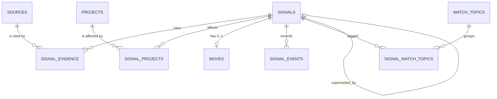

# P0 Data Schema — canonical

> **Status:** design artifact. Do **not** build until `../VALIDATION.md` passes.
> This is the schema a future MVP must start from — derived directly from
> [`signal-model.md`](signal-model.md) and [`decision-system.md`](decision-system.md),
> **not** from `spikes/web` (which drifts from the spec).

Stack assumption: Drizzle ORM + SQLite (Cloudflare D1), matching the frozen spike.
Nothing here is SQLite-specific in spirit; it ports to Postgres unchanged.

---

## 1. Design decisions (the load-bearing ones)

1. **Source and Signal are separate tables joined many-to-many.** The join
   (`signal_evidence`) is first-class because its fields describe a *relationship*,
   not either endpoint. Same for `signal_projects`. This is the whole product; it is
   not negotiable.
2. **`whyItMatters` is OPTIONAL** (the spike had it `NOT NULL` — that is the bug).
   Project relevance reasons usually carry the meaning; a cross-project note is
   extra, not required.
3. **No numeric truth.** `evidenceQuality` and `priority` are ordinal text enums with
   a rationale column. There is no 0–100 score, no averaged confidence, no weight.
4. **User-defined labels are data, not enums.** `domain`, `tags`, `project.name`,
   `decisionQuestions` are free text / JSON. Only genuinely controlled vocabularies
   (`sourceType`, relationships, dispositions, states) are CHECK-constrained enums.
5. **THE MOVE is a 0..1 side table keyed by `signalId`.** "No move" = no row (cleaner
   than nine nullable columns). One current move only; revisions go to history.
6. **History is append-only events**, not a mutable status machine. `signal_events`
   is write-once; material changes emit an event. Disposition / workflowStatus /
   executionState are three independent columns (never collapsed) per the decision
   system.
7. **Priority override is explicit and reasoned.** `priority` (effective),
   `priorityRuleResult` (what the gates said), `priorityOverrideReason` (required
   when they differ). The UI shows `Rule: P2 · Override: P1`.
8. **Provenance is a column, not a convention.** Anything AI can touch carries
   `USER | AI_DRAFT_CONFIRMED_BY_USER`. AI can never write a confirmed value.
9. **Text IDs everywhere** (`sig_…`, `src_…`, `proj_…`) so exports are readable and
   traceable, matching the model's own examples.
10. **WatchTopic ships minimal.** Two tables, no relevance score. If the manual test
    shows users never revisit themes independently of projects, delete both tables —
    the model explicitly permits this.

---

## 2. Entity map



---

## 3. Schema (`db/schema.ts`)

```ts
import { sql } from "drizzle-orm";
import {
  check,
  index,
  integer,
  primaryKey,
  sqliteTable,
  text,
  uniqueIndex,
} from "drizzle-orm/sqlite-core";

/* ---------- controlled vocabularies (CHECK-enforced) ---------- */
const SOURCE_TYPE = ["SCIENTIFIC_STUDY","OFFICIAL_ANNOUNCEMENT","POLICY_OR_REGULATION","DATASET_OR_DOCUMENTATION","TECHNICAL_REPORT","INDUSTRY_REPORT","JOURNALISM","EXPERT_COMMENTARY","OTHER"] as const;
const ORIGIN = ["PRIMARY","SECONDARY"] as const;
const PEER_REVIEW = ["YES","NO","NOT_APPLICABLE"] as const;
const METHOD_TRANSPARENCY = ["CLEAR","PARTIAL","OPAQUE","NOT_APPLICABLE"] as const;
const EVIDENCE_QUALITY = ["HIGH","MEDIUM","LOW"] as const;
const PRIORITY = ["P1","P2","P3"] as const;
const WORKFLOW_STATUS = ["OPEN","CLOSED"] as const;
const CLOSURE_REASON = ["RESOLVED","DISMISSED","SUPERSEDED","NO_LONGER_RELEVANT"] as const;
const DISPOSITION = ["UNDECIDED","MONITOR","TEST","ADOPT","DISMISS"] as const;
const RELATIONSHIP = ["SUPPORTS","CONTRADICTS","CONTEXTUALIZES"] as const;
const SCOPE_MATCH = ["DIRECT","INDIRECT"] as const;
const ATTENTION = ["HIGH","NORMAL"] as const;
const PROVENANCE = ["USER","AI_DRAFT_CONFIRMED_BY_USER"] as const;
const PROJECT_STATUS = ["ACTIVE","INACTIVE"] as const;
const WATCH_STATE = ["ACTIVE","DORMANT"] as const;
const CONFIRMATION_STATE = ["DRAFT","CONFIRMED"] as const;
const EXECUTION_STATE = ["NOT_STARTED","IN_PROGRESS","COMPLETED","CANCELLED"] as const;
const EVENT_TYPE = ["SIGNAL_CREATED","CLAIM_REVISED","EVIDENCE_ADDED_OR_CHANGED","QUALITY_CHANGED","PRIORITY_CHANGED","DISPOSITION_DECIDED","MOVE_CONFIRMED_OR_REVISED","MOVE_OUTCOME_RECORDED","SIGNAL_CLOSED_OR_REOPENED","SIGNAL_SUPERSEDED"] as const;

const inCheck = (col: string, vals: readonly string[]) =>
  sql.raw(`${col} in (${vals.map((v) => `'${v}'`).join(",")})`);

/* ---------- SOURCE — retrievable evidence ---------- */
export const sources = sqliteTable("sources", {
  id: text("id").primaryKey(),                                  // src_...
  title: text("title").notNull(),
  sourceType: text("source_type").notNull().$type<(typeof SOURCE_TYPE)[number]>(),
  publisher: text("publisher").notNull(),
  publicationDate: text("publication_date").notNull(),          // ISO; day/month/year precision allowed
  locator: text("locator").notNull(),                          // URL/DOI/report id
  origin: text("origin").notNull().$type<(typeof ORIGIN)[number]>(),
  peerReview: text("peer_review").notNull().$type<(typeof PEER_REVIEW)[number]>(),
  capturedAt: text("captured_at").notNull().default(sql`CURRENT_TIMESTAMP`),
  // optional
  authors: text("authors", { mode: "json" }).$type<string[]>(),
  accessedAt: text("accessed_at"),
  language: text("language"),
  version: text("version"),
  archivedLocator: text("archived_locator"),
  methodTransparency: text("method_transparency").$type<(typeof METHOD_TRANSPARENCY)[number]>(),
  notes: text("notes"),                                         // bibliographic/access notes ONLY
}, (t) => [
  check("sources_type", inCheck("source_type", SOURCE_TYPE)),
  check("sources_origin", inCheck("origin", ORIGIN)),
  check("sources_peer", inCheck("peer_review", PEER_REVIEW)),
  index("sources_publisher_idx").on(t.publisher),
]);

/* ---------- SIGNAL — reviewed interpretation ---------- */
export const signals = sqliteTable("signals", {
  id: text("id").primaryKey(),                                  // sig_...
  title: text("title").notNull(),
  claim: text("claim").notNull(),                              // 2–4 sentences
  domain: text("domain").notNull(),                           // user-defined, NOT an enum
  detectedAt: text("detected_at").notNull(),
  asOfDate: text("as_of_date").notNull(),                     // evidence currency
  evidenceQuality: text("evidence_quality").notNull().$type<(typeof EVIDENCE_QUALITY)[number]>(),
  evidenceRationale: text("evidence_rationale").notNull(),
  priority: text("priority").notNull().$type<(typeof PRIORITY)[number]>(),          // effective
  priorityRuleResult: text("priority_rule_result").notNull().$type<(typeof PRIORITY)[number]>(),
  priorityOverrideReason: text("priority_override_reason"),    // required iff effective != rule
  workflowStatus: text("workflow_status").notNull().default("OPEN").$type<(typeof WORKFLOW_STATUS)[number]>(),
  closureReason: text("closure_reason").$type<(typeof CLOSURE_REASON)[number]>(),   // required iff CLOSED
  disposition: text("disposition").notNull().default("UNDECIDED").$type<(typeof DISPOSITION)[number]>(),
  // optional
  whyItMatters: text("why_it_matters"),                       // OPTIONAL — the corrected field
  uncertainties: text("uncertainties", { mode: "json" }).$type<string[]>(),
  tags: text("tags", { mode: "json" }).$type<string[]>(),     // secondary, not a taxonomy
  supersededBySignalId: text("superseded_by_signal_id"),      // self-ref
  createdAt: text("created_at").notNull().default(sql`CURRENT_TIMESTAMP`),
  updatedAt: text("updated_at").notNull().default(sql`CURRENT_TIMESTAMP`),
}, (t) => [
  check("signals_quality", inCheck("evidence_quality", EVIDENCE_QUALITY)),
  check("signals_priority", inCheck("priority", PRIORITY)),
  check("signals_priority_rule", inCheck("priority_rule_result", PRIORITY)),
  check("signals_status", inCheck("workflow_status", WORKFLOW_STATUS)),
  check("signals_disposition", inCheck("disposition", DISPOSITION)),
  // closure reason present iff CLOSED
  check("signals_closure", sql`(workflow_status = 'CLOSED') = (closure_reason is not null)`),
  // override requires a reason
  check("signals_override_reason", sql`(priority = priority_rule_result) or (priority_override_reason is not null)`),
  index("signals_radar_idx").on(t.priority, t.workflowStatus),   // radar queue
  index("signals_disposition_idx").on(t.disposition),
]);

/* ---------- SIGNAL_EVIDENCE — claim-specific source↔signal link ---------- */
export const signalEvidence = sqliteTable("signal_evidence", {
  signalId: text("signal_id").notNull().references(() => signals.id),
  sourceId: text("source_id").notNull().references(() => sources.id),
  relationship: text("relationship").notNull().$type<(typeof RELATIONSHIP)[number]>(),
  scopeMatch: text("scope_match").notNull().$type<(typeof SCOPE_MATCH)[number]>(),
  evidenceNote: text("evidence_note"),                        // required for CONTRADICTS
  addedBy: text("added_by").notNull().$type<(typeof PROVENANCE)[number]>(),
  addedAt: text("added_at").notNull().default(sql`CURRENT_TIMESTAMP`),
}, (t) => [
  primaryKey({ columns: [t.signalId, t.sourceId] }),
  check("evidence_rel", inCheck("relationship", RELATIONSHIP)),
  check("evidence_scope", inCheck("scope_match", SCOPE_MATCH)),
  check("evidence_by", inCheck("added_by", PROVENANCE)),
  // contradiction must explain what it challenges
  check("evidence_contradiction_note", sql`relationship <> 'CONTRADICTS' or (evidence_note is not null and length(trim(evidence_note)) > 0)`),
  index("evidence_by_signal_idx").on(t.signalId),
  index("evidence_by_source_idx").on(t.sourceId),
]);

/* ---------- PROJECT — user-defined decision context ---------- */
export const projects = sqliteTable("projects", {
  id: text("id").primaryKey(),                                 // proj_...
  name: text("name").notNull(),                              // DATA, never schema
  description: text("description").notNull(),
  status: text("status").notNull().default("ACTIVE").$type<(typeof PROJECT_STATUS)[number]>(),
  decisionQuestions: text("decision_questions", { mode: "json" }).$type<string[]>(),
  domains: text("domains", { mode: "json" }).$type<string[]>(),  // discovery hints, not filters
  createdAt: text("created_at").notNull().default(sql`CURRENT_TIMESTAMP`),
  updatedAt: text("updated_at").notNull().default(sql`CURRENT_TIMESTAMP`),
}, () => [check("projects_status", inCheck("status", PROJECT_STATUS))]);

/* ---------- SIGNAL_PROJECTS — why a signal affects a project ---------- */
export const signalProjects = sqliteTable("signal_projects", {
  signalId: text("signal_id").notNull().references(() => signals.id),
  projectId: text("project_id").notNull().references(() => projects.id),
  reason: text("reason").notNull(),                          // the affected assumption/decision/metric
  implication: text("implication"),                          // only if it adds beyond reason
  attention: text("attention").$type<(typeof ATTENTION)[number]>(),  // only to escalate routing
  confirmedByUser: integer("confirmed_by_user", { mode: "boolean" }).notNull().default(false),
  createdAt: text("created_at").notNull().default(sql`CURRENT_TIMESTAMP`),
  updatedAt: text("updated_at").notNull().default(sql`CURRENT_TIMESTAMP`),
}, (t) => [
  primaryKey({ columns: [t.signalId, t.projectId] }),
  check("sp_attention", sql`attention is null or attention in ('HIGH','NORMAL')`),
]);

/* ---------- MOVES — THE MOVE, 0..1 per signal ---------- */
export const moves = sqliteTable("moves", {
  signalId: text("signal_id").primaryKey().references(() => signals.id),   // enforces 0..1
  text: text("text").notNull(),                             // verb-led next step
  rationale: text("rationale").notNull(),                   // why it's the smallest step
  basisAsOf: text("basis_as_of").notNull(),                // evidence date behind it
  reviewTrigger: text("review_trigger").notNull(),         // condition/result/date to reconsider
  recommendationProvenance: text("recommendation_provenance").notNull().$type<(typeof PROVENANCE)[number]>(),
  confirmationState: text("confirmation_state").notNull().default("DRAFT").$type<(typeof CONFIRMATION_STATE)[number]>(),
  executionState: text("execution_state").notNull().default("NOT_STARTED").$type<(typeof EXECUTION_STATE)[number]>(),
  dueDate: text("due_date"),
  outcomeNote: text("outcome_note"),                        // required when COMPLETED/CANCELLED
  updatedAt: text("updated_at").notNull().default(sql`CURRENT_TIMESTAMP`),
}, () => [
  check("moves_prov", inCheck("recommendation_provenance", PROVENANCE)),
  check("moves_confirm", inCheck("confirmation_state", CONFIRMATION_STATE)),
  check("moves_exec", inCheck("execution_state", EXECUTION_STATE)),
  check("moves_outcome", sql`execution_state not in ('COMPLETED','CANCELLED') or (outcome_note is not null and length(trim(outcome_note)) > 0)`),
]);

/* ---------- WATCH_TOPICS (minimal; delete if unused after the test) ---------- */
export const watchTopics = sqliteTable("watch_topics", {
  id: text("id").primaryKey(),
  name: text("name").notNull(),
  monitoringQuestion: text("monitoring_question").notNull(),
  state: text("state").notNull().default("ACTIVE").$type<(typeof WATCH_STATE)[number]>(),
  lastReviewedAt: text("last_reviewed_at"),
}, () => [check("watch_state", inCheck("state", WATCH_STATE))]);

export const signalWatchTopics = sqliteTable("signal_watch_topics", {
  signalId: text("signal_id").notNull().references(() => signals.id),
  watchTopicId: text("watch_topic_id").notNull().references(() => watchTopics.id),
  linkedAt: text("linked_at").notNull().default(sql`CURRENT_TIMESTAMP`),
}, (t) => [primaryKey({ columns: [t.signalId, t.watchTopicId] })]);

/* ---------- SIGNAL_EVENTS — append-only history ---------- */
export const signalEvents = sqliteTable("signal_events", {
  id: integer("id").primaryKey({ autoIncrement: true }),
  signalId: text("signal_id").notNull().references(() => signals.id),
  eventType: text("event_type").notNull().$type<(typeof EVENT_TYPE)[number]>(),
  payload: text("payload", { mode: "json" }).notNull(),      // {previous,new,reason,...}
  actor: text("actor").notNull().$type<(typeof PROVENANCE)[number]>(),
  createdAt: text("created_at").notNull().default(sql`CURRENT_TIMESTAMP`),
}, (t) => [
  check("events_type", inCheck("event_type", EVENT_TYPE)),
  check("events_actor", inCheck("actor", PROVENANCE)),
  index("events_by_signal_idx").on(t.signalId, t.createdAt),
]);
```

Run `npm run db:generate` (drizzle-kit) to emit the migration; do not hand-write SQL.

---

## 4. Invariants the DB can't express — enforce in the domain layer

CHECK constraints cover single-row rules. These are cross-row / logical and must
live in one place (a domain module the API calls), **not** scattered in UI:

| # | Invariant | Source |
|---|---|---|
| I1 | A *reviewed* Signal has ≥1 `signal_evidence` row. Drafts may have zero but are flagged unreviewed. | mvp-backlog P0.2 |
| I2 | THE MOVE is **required** when `priority='P1'` OR `disposition IN ('TEST','ADOPT')`. | decision-system §THE MOVE |
| I3 | `disposition='MONITOR'` requires a non-empty `move.reviewTrigger`. "Keep an eye on it" is invalid. | decision-system |
| I4 | `CONTEXTUALIZES` links are **never counted as support** in the evidence tally or quality rubric. | signal-model |
| I5 | Independent-corroboration = distinct evidence chains, not syndication. A human sets quality; the app never infers HIGH from source count. | decision-system |
| I6 | `signal_events` is append-only: no UPDATE/DELETE. Emit an event on every material change (claim, quality, priority, disposition, move, closure, supersession). | signal-model §Event history |
| I7 | AI may write `*_DRAFT`/unconfirmed rows only. It may never set `confirmedByUser=true`, `confirmationState='CONFIRMED'`, evidence quality, disposition, or closure. | AGENTS.md AI rules |
| I8 | Supersession: set successor's link, set predecessor `workflowStatus='CLOSED', closureReason='SUPERSEDED', supersededBySignalId=<successor>`; keep both claims; the current move lives only on the successor. | decision-system |
| I9 | Re-run the evidence rubric (and emit `QUALITY_CHANGED`) when a source/relationship/claim-scope changes or a contradiction appears. | decision-system |
| I10 | Move lint (reject vague verbs, "read the source", "why it matters" restated, no completion condition) before allowing `confirmationState='CONFIRMED'`. | decision-system §Move lint |

---

## 5. Query plan for the five surfaces

| Surface | Query | Index used |
|---|---|---|
| **Radar** (finite P1/P2 queue) | `WHERE workflow_status='OPEN' ORDER BY priority, <tie-breakers>` | `signals_radar_idx` |
| **Signal Detail** | signal + its `signal_evidence`⨝`sources`, `signal_projects`⨝`projects`, `moves`, `signal_events` | `evidence_by_signal_idx`, `events_by_signal_idx` |
| **Evidence library** | `sources` + reverse lookup via `signal_evidence` | `evidence_by_source_idx` |
| **Projects** | `projects` + linked signals via `signal_projects` | PK |
| **Watch** | `watch_topics` + changed signals via `signal_watch_topics` | PK |

Radar tie-breakers (deterministic, from decision-system): unresolved review trigger →
explicit deadline → confirmed high-attention link → contradiction/evidence change since
last review → oldest unreviewed. Compute in the query/domain layer, never by popularity or recency.

---

## 6. Traceability — every table maps to the spec

| Table | Spec section |
|---|---|
| `sources` | signal-model §Source |
| `signals` | signal-model §Signal + decision-system §Priority/§Evidence quality |
| `signal_evidence` | signal-model §SignalEvidence |
| `projects` | signal-model §Project |
| `signal_projects` | signal-model §SignalProjectRelevance |
| `moves` | signal-model §THE MOVE + decision-system §THE MOVE decision rule |
| `watch_topics`, `signal_watch_topics` | signal-model §WatchTopic |
| `signal_events` | signal-model §Event history |

---

## 7. Deliberately NOT in P0

No numeric/composite scores, no embeddings/vector tables, no full-text/RAG index, no
users/roles/orgs table, no tasks/subtasks/assignees on moves, no ingestion/feed tables,
no ML ranking columns. Adding any requires manual-test evidence and a Product Contract
update (mvp-backlog §"Explicitly not backlogged").
